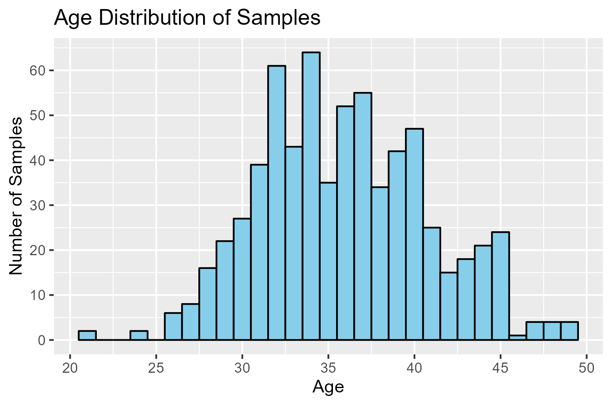
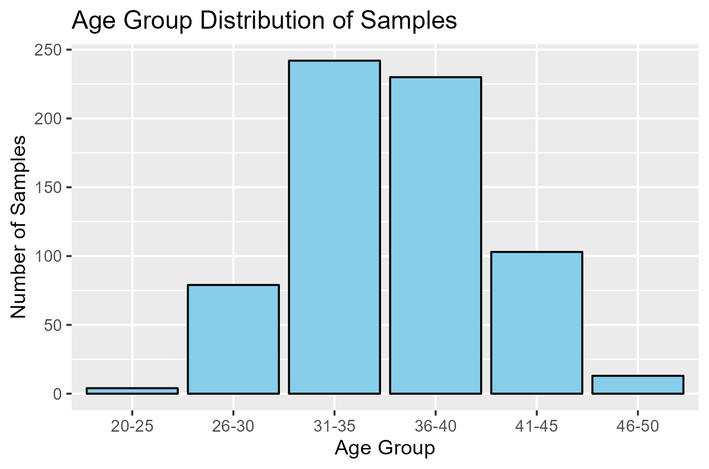
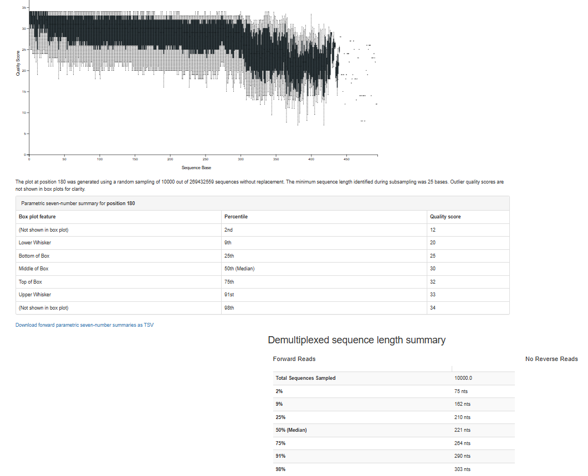

# February 10, 2025

## Agenda
- Discuss R code and the age binning we decided on
- Start planning team proposal and dividing work

### What we have done
R Portion:
- Loaded IVF dataset into R and made a histogram to show the number of samples for each age

- Decided to bin ages as follows: 25-30, 35-40, 40-45, 45-50. Will filter out the age 20-25 groups.

Qiime2 Processing:
- Imported dataset and demultiplexed sequences. Sample size before demultiplexing = 824 samples
- Denoised sequences using DADA2. Set truncation length at 303 base pairs based on the interactive quality plot from demultiplexing sequences below:

### Questions to ask
- Primer choice for classifier training -> Thermofisher
  - TA response: further digging required -> Carson has emailed Ritu the link (troubleshoot WIP) 

## Meeting Notes
- TA Proposal Suggestions:
  - Shorten the title and use an -ing word (e.g. "starting", "exploring", etc.)
  - Maintain a formal tone with objective language
  - Engage in frequent peer feedback/editing (e.g. flow/cohesion)
  - Cite all references clearly and use the metrics on Canvas as a guide
    - URL: https://canvas.ubc.ca/courses/153512/assignments/2015684
    - Note: maybe mention the data set during the first paragraph
  - For the hypothesis, clearly state context (RA: it should sound "informed and researched")
  - Divide research question into distinct parts(?)

## Next week
- Refine the research question:
  - Emphasize the pregnancy outcomes and differences in age groups/microbiomes
  - DE-emphasize the "endometrial microbiota sample types"
    - this part can go into Aims, but shouldn't be the primary focus
  - Aim 1: taxonomic differences across age groups
    - Really emphasize the novelty of Age Group Analysis and also highlight pre-established research
  - Aim 2: functional analysis -> you can only really compare pair-wise (based off TA experience)
    - Emphasize pathways
- Reading week -> if meeting is needed, a zoom can be scheduled
  - Let Ritu know by the end of the week

## Future Reference
- Dr. Evelyn Sun will be around for the last 2 meetings to help clarify/troubleshoot
  - Be prepared for these last 2 meetings 
