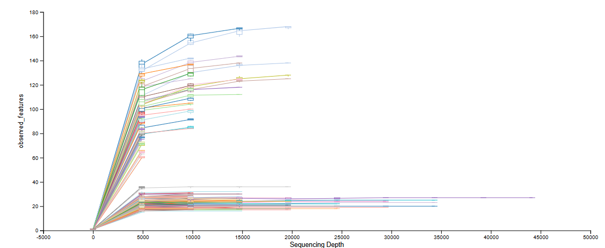
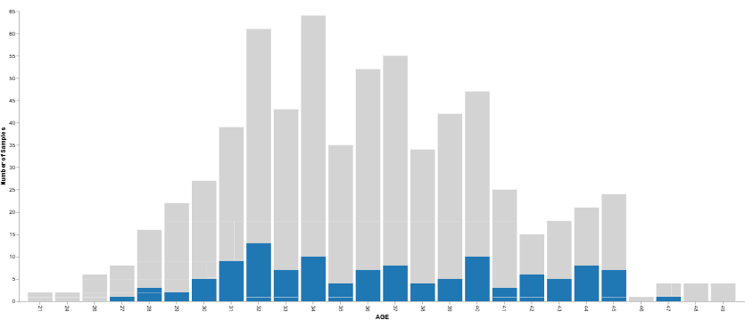
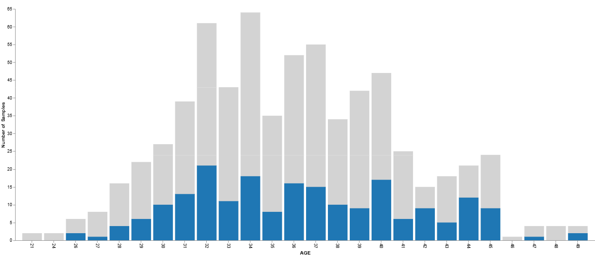
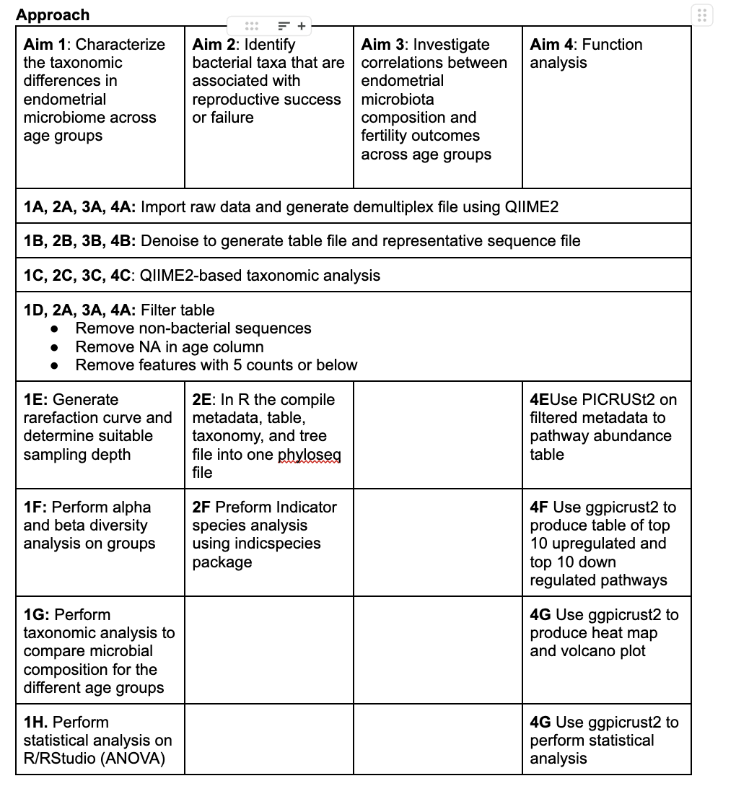

# February 19, 2025

## Agenda

### What we have done
R Portion:

Qiime2 Processing:
- trained classifer over entire database because many variable regions sequenced by paper
- taxonomic analysis using untrained classifier
- filtered out mitochondria & chloroplast from table
- filtered out NAs is the age column of metadata
- created visualization of ASV stats (omitted mitochondria & chloroplast, no NA age)
- generated tree for phylogenetic diversity analysis
- alpha rarefaction
  1. screenshot of alpha rarefaction curve based on sample (not too sure what sampling depth to use, somewhere between 5000-10000?)
        
  2. sampling depth of 10000 (Retained 1,180,000 (36.03%) features in 118 (17.59%) samples at the specifed sampling )
        
  3. sampling depth of 5000 (Retained 1,025,000 (31.30%) features in 205 (30.55%) samples at the specifed sampling)
        

Proposal:
- Introduction (rough draft)
- Research question and hypothesis (rough draft)
- Experimental aims and proposed step-by-step appraoch 

### What we still have to do for proposal
- Gaant chart
- Dataset overview in more detail
- The rationale behind the experimental aims
- Edit + references 

### Questions to ask
- Research Question: How does endometrial microbial diversity differ across age groups and correlate with IVF reproductive outcome?
- Sampling depth based on alpha rarefaction

Our experimental aims are:
1. Characterize the microbial diversity in the endometrium across different age groups
2. Identify bacterial taxa that are associated with reproductive success or failure
3. Investigate correlations between endometrial microbiota composition and fertilitiy outcomes across age groups
4. Functional analysis of the different microbes composing the microbiomes of different ages and fertility outcomes (potentially take out)

Rough outline of how we plan to achieve each aim (we need some guidance and to work on this more as a group):

## Meeting Notes
2. for aim 3, rephrase "investigate correlation" so there's more emphasis on the diversity analysis. becomes the new aim 1
3. for aim 2, reference paper result as well. explain why we are doing it again and potential changes we might make. add across age groups, find indicator species. becomes the new aim 2
4. in each paragraph for aims, mention what you expect to see and why (reference paper).
5. 1f. mention what metric (e.g. look at diff outcomes across age groups), be more specific for everything (1H)
6. sampling depth : 10000 is ok
7. make sure aims are all novel, not what paper already covered
8. diversity: look at diversity between age group bins, and diversity between outcomes.
   - filter outcome with a successful pregnancy, identify age groups (e.g. early 30s).
       - e.g. in case of successful pregnancy, how diversity varies.
       - do the same for each outcome
   - filter within a specific age group, identify different outcomes
9. function analysis is pairwise, will have lots of groups. can choose which groups to look at based on taxonomic results. can also bin into bigger groups (e.g. 21-30, 31-40)
10. in dataset overview mention how we bin age groups.
11. in intro/hypothesis mention why we want to look at different age groups. add numbers to support our argument. 
   

## Next week

## Future Reference
- Dr. Evelyn Sun will be around for the last 2 meetings to help clarify/troubleshoot
  - Be prepared for these last 2 meetings 

