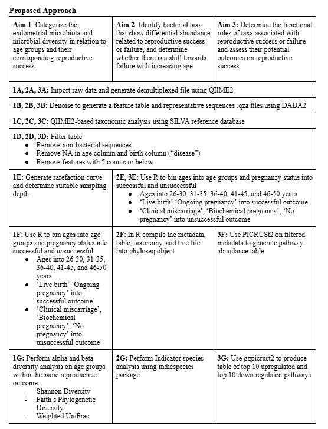

# February 24, 2025

## Agenda

### What we have done
R Portion:
- start working on project according to timeline

Qiime2 Processing:
- finished

Proposal:
- finished
- proposed approach:

### Questions to ask

## Meeting Notes
- Divide samples based on reproductive success, age = continous variable. Plot y = ASVs, x = age (continous variable). Regression analysis where lines show correlation with increase in age and ASV increase/decrease (applicable method for analyzing alpha diversity)
-    Ritu will send link of example
-    Using R, calculate alpha diversity
  
Reveiwing aims

**Aim 1**
- Name of aim is slightly misleading, rephrase it for resubmission
- Steps are good
  
**Aim 2**
- Ritu question: Once know which ones different b/w age groups, how do we link the results to the pregnancy outcomes?
- Edits to aim2:
   - Bin into success vs failure and do ISA to see species abundance
   - Then bin into age groups, do ISA, observe how the number of the specific species associated with success vs failure change with increasing age
   - If get chance to resubmit proposal, add something about this to approach to increase clarity
 
**Aim 3**
- Approach good

**Aims overall**
- If get feedback about aims/clarity add a little bit about the notes above to the table
- Overall approach is good 

## Week tasks
- Get some of the R processing done and try to get some results for next week to show and ask about
- Divide up work to start working on project aims
   - All make R script to run code, have 2 people run over same thing and upload script to github
   - Then at end compile it all
 
Dividing up work:
- Annalise Aim 1 and double check Aim 3
- Michelle Aim 2 and double check Aim 1
- Carleton Aim 2
- Wren Aim 3

## Future Reference
- Dr. Evelyn Sun will be around for the last 2 meetings to help clarify/troubleshoot
  - Be prepared for these last 2 meetings 

