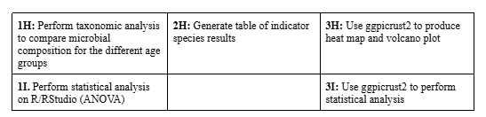

# February 24, 2025

## Agenda

### What we have done
R Portion:
- start working on project according to timeline

Qiime2 Processing:
- finished

Proposal:
- finished
- proposed approach:

### Questions to ask

## Meeting Notes
- Divide samples based on reproductive success, age = continous variable. Plot y = ASVs, x = age (continous variable). Regression analysis where lines show correlation with increase in age and ASV increase/decrease (applicable method for analyzing alpha diversity)
-    Ritu will send link of example
-    Using R, calculate alpha diversity
  
Reveiwing aims

**Aim 1**
- Name of aim is slightly misleading, rephrase it for resubmission
- Steps are good
  
**Aim 2**
- Ritu question: Once know which ones different b/w age groups, how do we link the results to the pregnancy outcomes?
- Edits to aim2:
   - Bin into success vs failure and do ISA to see species abundance
   - Then bin into age groups, do ISA, observe how the number of the specific species associated with success vs failure change with increasing age
   - If get chance to resubmit proposal, add something about this to approach to increase clarity
 
**Aim 3**
- Approach good

**Aims overall**
- If get feedback about aims/clarity add a little bit about the notes above to the table
- Overall approach is good 

## Week tasks
- Get some of the R processing done and try to get some results for next week to show and ask about
- Divide up work to start working on project aims
   - All make R script to run code, have 2 people run over same thing and upload script to github
   - Then at end compile it all
 
Dividing up work:
- Annalise Aim 1 and double check Aim 3
- Michelle Aim 2 and double check Aim 1
- Carleton Aim 2
- Wren Aim 3

## This Week's Meeting/Discussion Notes and Comments (25.03.24):
- 1.1 Alpha Diversity
  - **Change graphic method: Graph as scatterplot + best fit line + ribbon line plot**
  - (Send email if we don't know how to graph it; Dr. Sun has the code);
  - Expect to see NO correlation, but "at least it will be graphed correctly"
- 1.2 Beta Diversity ("that's so weird")
  - Teaching team (TT) is absolutely fascinated by the 4 clusters
  - "Bray Curtis doesn't mean much to me" -> but it's based on weigt.. don't know if should rid of outliers
- 1.3a Taxonomic Analysis ("that's so strange!" **"these are the strangest microbiomes I've ever seen"**)
  - Actinobacter, Streptomyces ("it's found in soil" and "it makes antibiotics")... dominated by one
  - "These women have very strange microbiomes" (might explain WHY they need IVF)
- Aim 1 Overall trends: IVF women seem to have very strange microbiomes. ("It boggles the mind a little")
- 2.1 Core
  - The 26-30 have 7 unique (4/7 are lactobaccilus) vs 46-50 have 5
  - Most shared microbiome... the ongoing group tends to have Bad species...
  - Miscarriage ones have beneficial commensal while the ongoing pregnancy ones have pretty pathogenic ones...
  - Loved the floral venn diagrams
- Aim 2 Overall trends: "I feel like there are findings here, but can't tell what". "None of this is useable"
  - "What does this mean?"
  - TT unsurprised that ISA yields 
- Overall comments:
  - Significance of streptomyces -> "why is it everywhere?"
 
##Future Directions
- TT said that they do not expect much from functional analysis
- Successful VS NOT successful > ages (although, there is something interesting happening in the older age groups)
- TT proposed a simple **Machine Learning thing** -> random forest/RF (predicts which microbes are more important in whether someone has a successful pregnancy or not; "the code itself is actually quite simple")
  - "there is a story in here"

## Future Reference
- Simple Machine Learning: RF
  - Take OTU table, and train the AI to find patterns in the OTU, and apply model to (just) outcome and then outcome/age (create 2 separate tables)
  - It creates decision trees for all patterns
  - Take in individual OTUs... 70% of data used for training, 30% use for applied/testing
    - Hopefully sample size is approximately equal across groups -> try randomly sampling to make more equal samples
    - randomforest(Species~., data=train, proximity=TRUE)
  - Output: ROC curve (accuracy of the model) +  termines importance of individual features (is it the streptomyces)
  - Dr. Sun will send all the scripts; we can just copy her code as it is
  - Reading an RF table: The closer the 3 lines are in the visualization, the better the model is
  - varImpPlot( ) <- Dr. Sun suspects that this will yield the most meaningful graph for our data
  - accuracy: 80-90 is good... anything between 60-70 is undecided.
