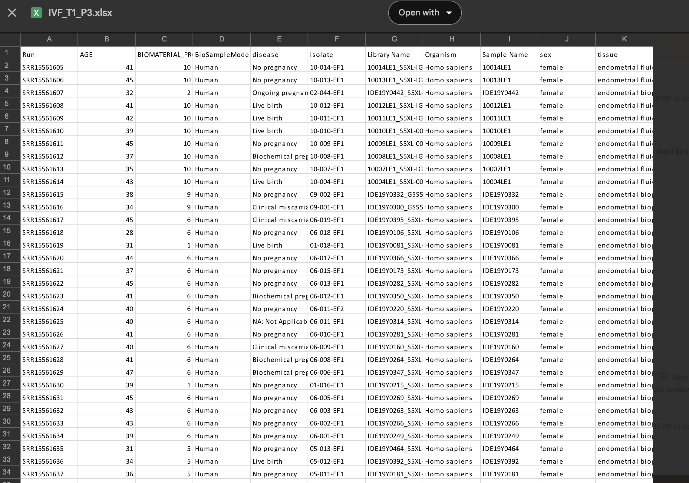

# February 3, 2025

## Agenda
- Chosen topic: IVF and the endometrial microbiome
  
[Paper we got dataset from](https://microbiomejournal.biomedcentral.com/articles/10.1186/s40168-021-01184-w)

Metadata variables within dataset: age, biomaterial provider, biosample model, disease, isolate, library name, organism, sex, tissue

Screenshot of dataset:

### Potential Topic Questions: 
Age related: data set includes age 21-49
- How does the distribution of endometrial microbiota sample types (EF vs. EB) vary across different age groups?
- Does age correlate with reproductive success (live birth vs. no pregnancy)?

Biomaterial provider: metadata includes 19 different biomaterial providers (1-19)
- Do microbiota profiles differ between samples from different biomaterial providers?
- Could sample processing techniques at different centers influence microbiota composition and affect the study’s conclusions?
- paper mentioned 13 different centres on three continents. howver did not specify which centres corresponds to provider on metadata.

Other potential questions: the paper mentioned the ethnic distribution: caucasian 57.3%, east asian 14.0%, hispanic 11.4%, others 17.3%. If possible to obtain data for metadata category, could also look at potential differences in microbiota composition in different ethnicities.

## Meeting Notes

