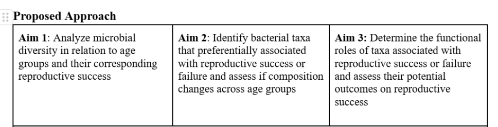

# March 10 2025

### What we have done

Proposal Re-submission
- Finished editing it and making changes, just have to hand it in
 

R portion:
- Phyloseq object rarefaction curve chose: 2500

Qiime2:
- Redid the denoising step using rarefaction parameter: 5000 instead of 10 000
- So likely have to redo R coding that we have already done to take into account new sampling depth

### Questions to ask/Issues

### Meeting Notes
- for ISA, create new metadata column with both outcome and agegroup
- Aim 1: use data with updated rarefaction parameter to update R script and diversity metrics
- Aim 2 (ISA):
  - Couldn't find any species common/associated with unsuccessful pregnancy outcome
  - Add a separate metadata column: (i.e) "successful_agegroup_1". Acts to filter all the samples that are successful and fall under a particular age group
  - Do coremicrobiome as well
- Aim 3: go over PICRUST modules 

### Next Week
