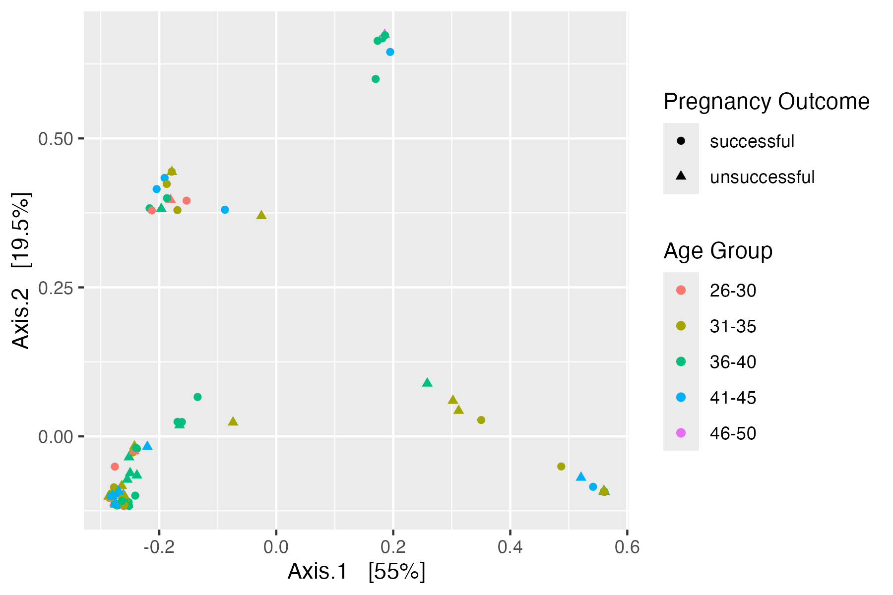

# March 17 2025

### What we have done

##### Aim 1 (Annalise):
Ran Beta diversity metrics
- Weighted Unifrac:
  
  
  
  Statistical Test:

   

- Bray-Curtis:

  

  Statistcial Test:

  

Taxonomic Composition

Alpha diveristy metrics 
- Shannon's Diversity:

- Faith's PD:

Still have to do:
- Linear regression model
- Taxonomic composition statistical analysis

##### Aim 2 (Michelle and Carleton):
Core microbiome based on outcome (detecion= 0.001, prevalence = 0.1)
- 
Core microbiome based on outcome (detecion= 0.001, prevalence = 0.2)
- 
ISA analysis based on age group and outcome (p= 0.05)
- 
ISA analysis based on age group and outcome (p= 0.1)
- 

##### Aim 3 (Wren):

### Questions to ask/Issues

### Meeting Notes

### Next Week
