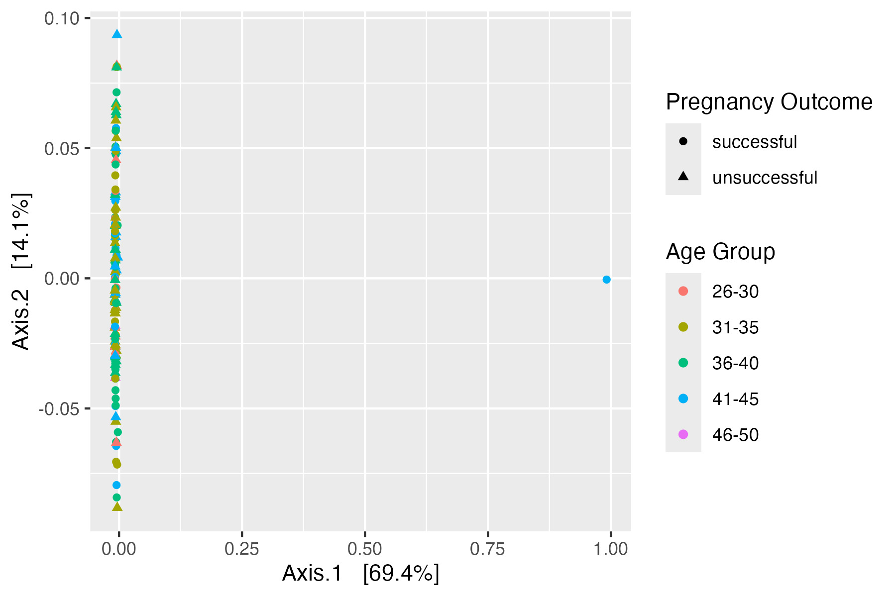

# March 17 2025

### What we have done

##### Aim 1 (Annalise):
Ran Beta diversity metrics
- Weighted Unifrac:
  
  
  
  Statistical Test:

   

- Bray-Curtis:

  

  Statistcial Test:

  

Taxonomic Composition

Alpha diveristy metrics 
- Shannon's Diversity:

- Faith's PD:

Still have to do:
- Linear regression model
- Taxonomic composition statistical analysis

##### Aim 2 (Michelle):
Core microbiome based on outcome (detecion= 0.001, prevalence = 0.1): only 1 ASV that is unique to unsuccessful core microbiome, and 6 ASVs unique to successful core microbiome. 
- 
- 
- 
Core microbiome based on outcome (detecion= 0.001, prevalence = 0.2)
- 
ISA analysis based on age group and outcome (p= 0.05)
- 
ISA analysis based on age group and outcome (p= 0.1)
- 

Still have to do:
- Statistical analysis

### Questions to ask/Issues
- CONTRADICTS PAPER FINDING: core microbiome analysis showed that Lactobacillus was the only unique ASV in the unsuccessful group, and streptomyces (along with 5 unassigned) is among the 6 unique ASVs in the successful group.
- 
### Meeting Notes
- linear regression plots can replace shannon diversity graphs
- for unassigned species, find the corresponding file (reps seq file) for blast
- complete result analysis by next monday, so will have time to complete additional analysis
- can start working on slides this week
- slides need to be submitted on March 30th (with a background and why we did this study), and have one day to prepare.
- have 10 min to ask the other team on the day of presentation, 10 min of presentation time, no speaker notes
- presentation details will be released soon

- taxonomic composition bar plots:
    - go down one more level in order to tell difference
    - don't need statistical test
- alpha diversity:
    - use linear regression code, one for shannon diversity, one for faith's pd
    - also add shannon to meta data like what was done with pd
- for core microbiome: 
    - can look into the literature 
    - can try to see if there are differences based on different outcomes (not just successful and unsuccessful)
      

### Next Week
- evelyn joins meeting next week
- need to present result next week during the meeting, have all three aims ready

