# March 24 2025

### What we have done

##### Aim 1 (Annalise):
Alpha Diversity:

- Shannon's Diversity:
  
 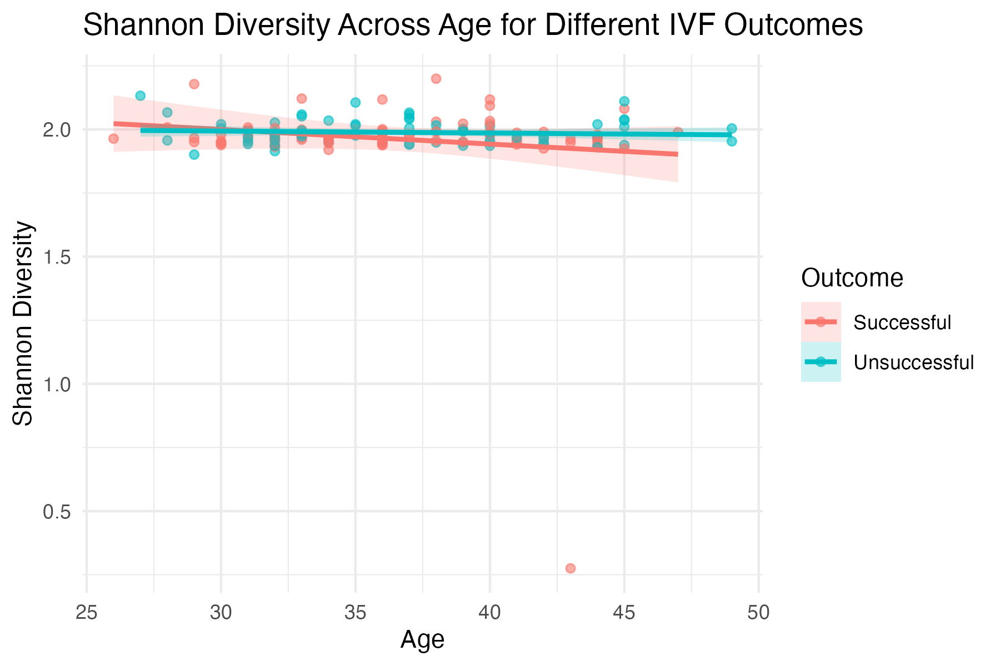

 - Faith's PD:
   
 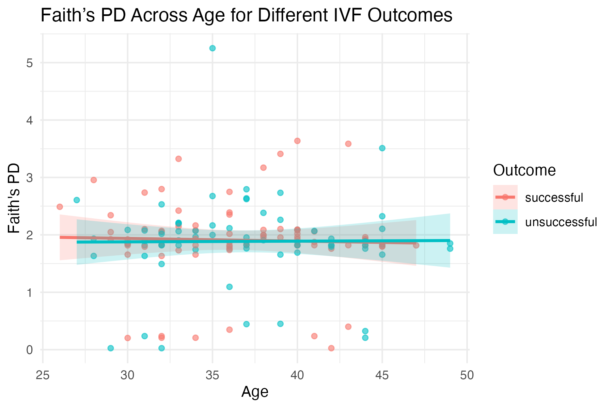

Beta Diversity:

- Weighted Unifrac:
  
 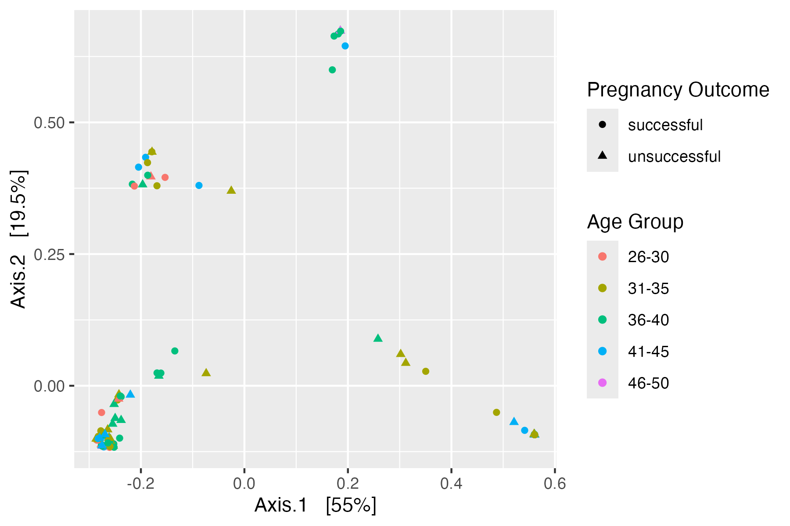

 - Bray Curtis:
   
 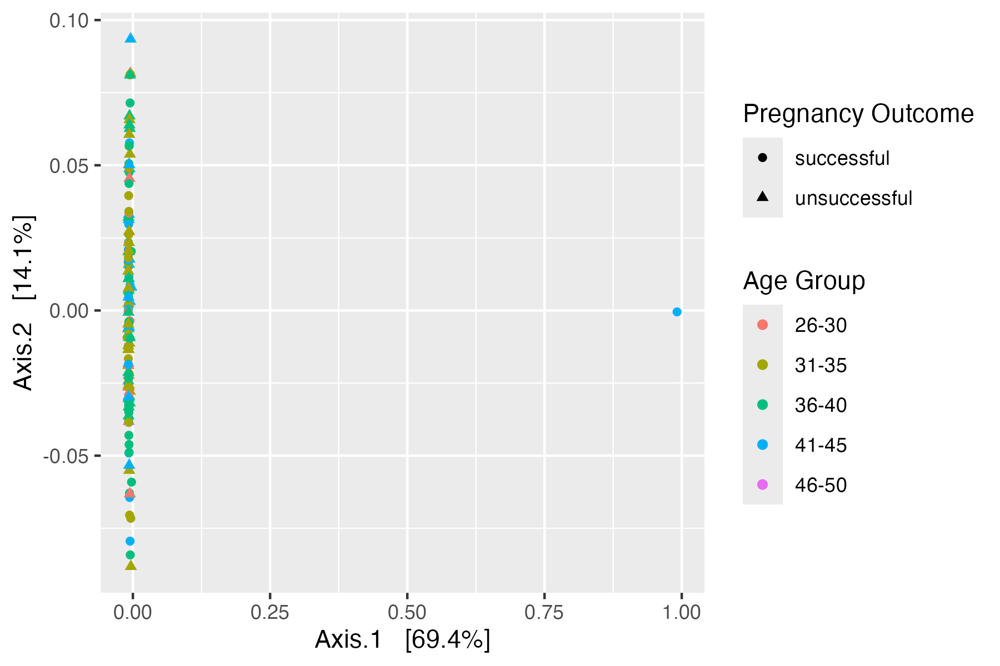
 
 Taxonomic Analysis

 - By phylum

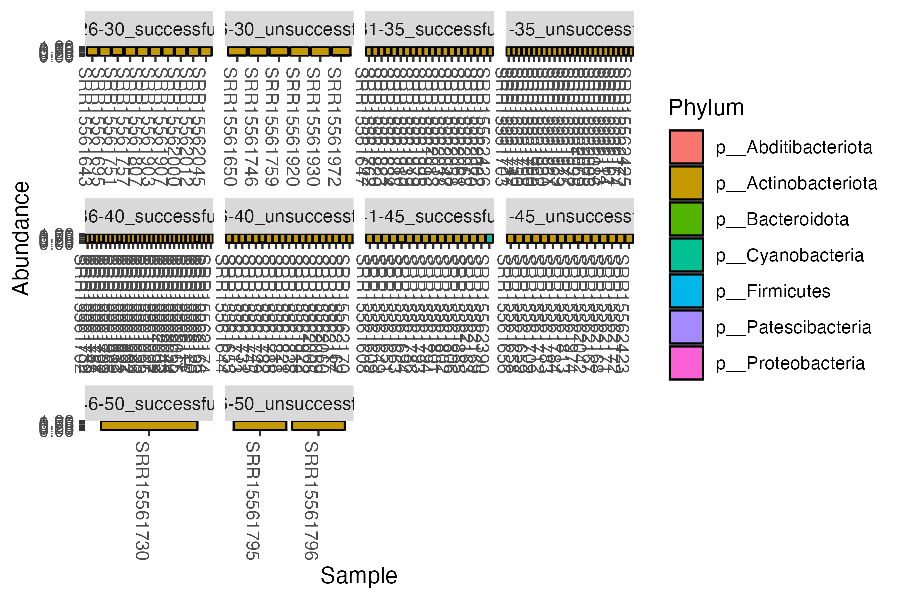

 - By class

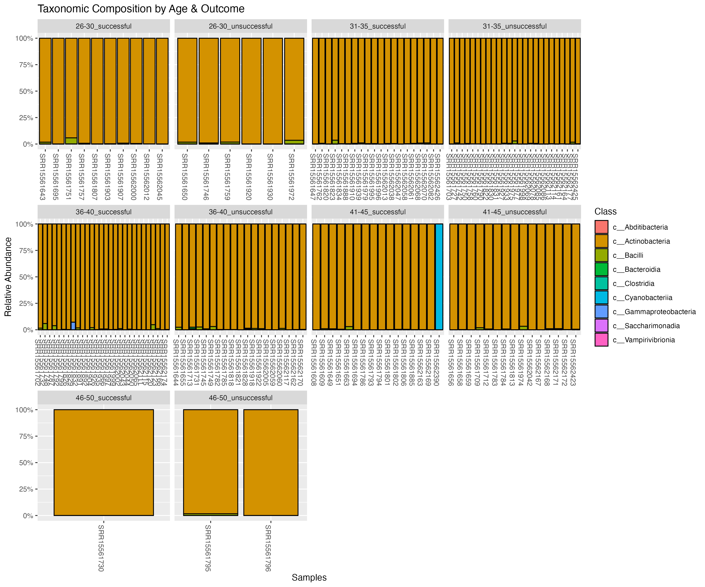

 - By order

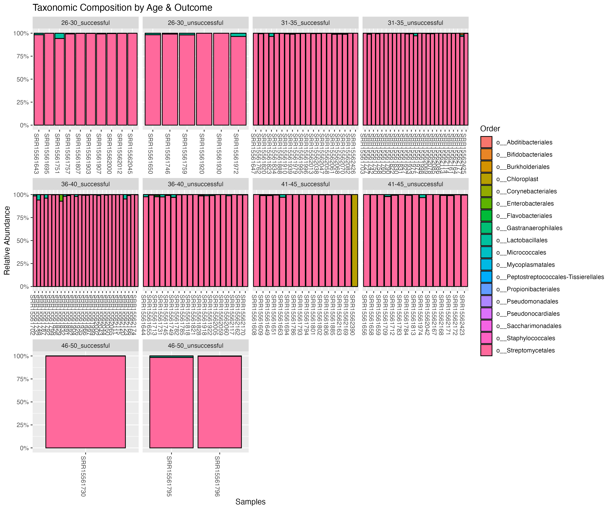

 - By family

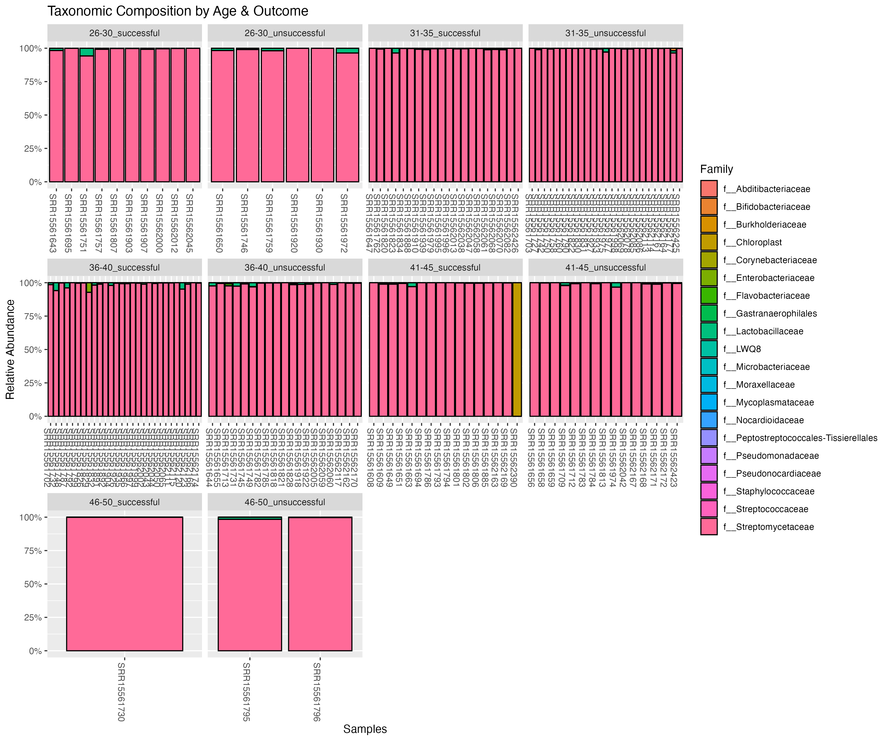

 - By genus

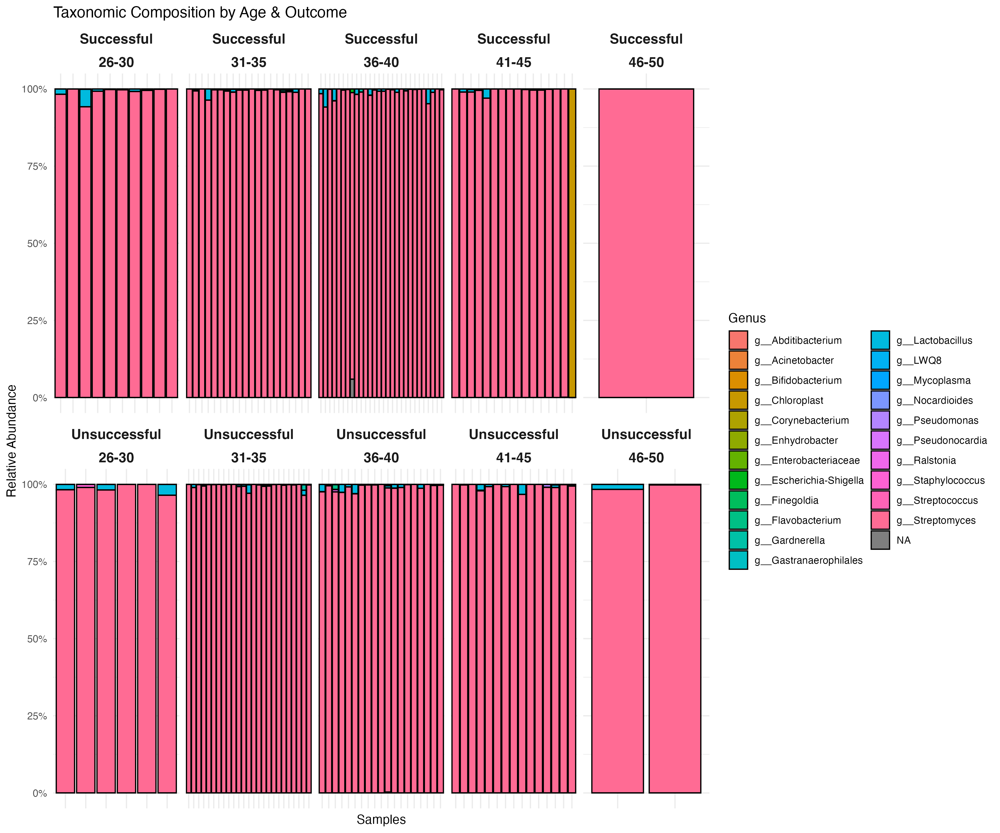

 - By species

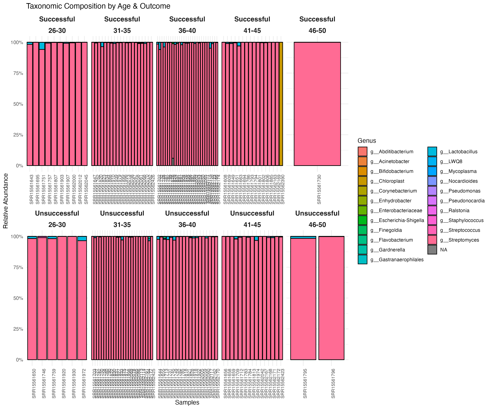

##### Aim 2 (Michelle):
core microbiome analysis based on binned outcome (successful/unsucessful)
- detection = 0.001, prevalence = 0.1
   
  
  
  
  blast result for successful
  - for 9e4c804464f77d50c7c59e8c7b9257a6: https://blast.ncbi.nlm.nih.gov/Blast.cgi?CMD=Get&RID=XP9U1J9V016&ADV_VIEW=yes&CONFIG_DESCR=ClustMemNbr,ClustComn,Ds,Sc,Ms,Ts,Cov,Eval,Idnt,AccLen,Acc
  - for 1fde48464b31018bed6fe7a09a95af5a: https://blast.ncbi.nlm.nih.gov/Blast.cgi?CMD=Get&RID=XP9UFFMV016&ADV_VIEW=yes&CONFIG_DESCR=ClustMemNbr,ClustComn,Ds,Sc,Ms,Ts,Cov,Eval,Idnt,AccLen,Acc
  - for 09a089478b7b99dcb7e80e48fdde2bb8: https://blast.ncbi.nlm.nih.gov/Blast.cgi?CMD=Get&RID=XP9UWFBN016&ADV_VIEW=yes&CONFIG_DESCR=ClustMemNbr,ClustComn,Ds,Sc,Ms,Ts,Cov,Eval,Idnt,AccLen,Acc
  - for abd0fd4ccead365353f4022389f54f91: https://blast.ncbi.nlm.nih.gov/Blast.cgi?CMD=Get&RID=XP9V4756016&ADV_VIEW=yes&CONFIG_DESCR=ClustMemNbr,ClustComn,Ds,Sc,Ms,Ts,Cov,Eval,Idnt,AccLen,Acc&ADV_VIEW=yes&CONFIG_DESCR=ClustMemNbr,ClustComn,Ds,Sc,Ms,Ts,Cov,Eval,Idnt,AccLen,Acc

  

core microbiome analysis based on all 5 outcomes (live birth, on-going pregnancy, no pregnancy, clinical miscarriage, biochemical pregnancy) 
- detection = 0.001, prevalence = 0.1

  

core microbiome analysis based on age groups 
- detection = 0.001, prevalence = 0.1

  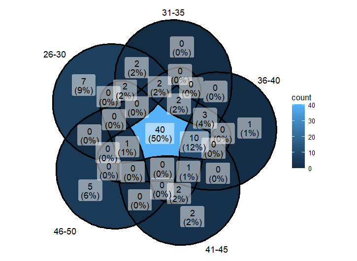

## This Week's Meeting/Discussion Notes and Comments (25.03.24):
 1.1 Alpha Diversity
  - ACTIONABLE: **Change graphic method: Graph as scatterplot + best fit line + ribbon line plot** 
  - Actionable: (Send email if we don't know how to graph it; Dr. Sun has the code);
  - Expectation: Expect to see NO correlation, but "at least it will be graphed correctly"
- 1.2 Beta Diversity ("that's so weird")
  - Teaching team (TT) is absolutely fascinated by the 4 clusters 
  - Bray Curtis ... TT said that they don't know if we should rid of outliers
- 1.3a Taxonomic Analysis ("that's so strange!" **"these are the strangest microbiomes I've ever seen"**)
  - TT fascinated by Streptomyces ("it's found in soil" and "it makes antibiotics") 
  - TT Comment: "These women have very strange microbiomes" (might explain WHY they need IVF)
- Aim 1 Overall trends: "IVF women seem to have very strange microbiomes." ("It boggles the mind a little")
- 2.1 Core
  - (The 26-30 have 7 unique (4/7 are lactobaccilus) vs 46-50 have 5)
  - (Most shared microbiome... the ongoing group tends to have BAD species...)
  - TT comment: Miscarriage ones have beneficial commensal while the ongoing pregnancy ones have pretty pathogenic ones...
  - (Dr. Sun loved the floral venn diagrams)
- Aim 2 Overall trends: "I feel like there are findings here, but can't tell what". "None of this is useable"
  - Dr. Sun: "What does this mean!?"
  - TT unsurprised that ISA seems to yield no helpful info 
- Overall comments:
  - Significance of streptomyces -> "why is it everywhere?"

#Future Directions (Expectations)
- TT said that they do not expect much from functional analysis
- Successful VS NOT successful > ages (although, there is something interesting happening in the older age groups)

##Future Directions: Presentation Slides/Figures
- Slides:
  - Workshot the **title**... something like "age does NOT affect..."
    - dig into how age/success are independent and how there is no effect?
  - **Figure 1:** change alpha diversity metrics... **Graph as scatterplot + best fit line + ribbon line plot**
  - **Figure 2:** taxa bar plots... let's keep it for now. JUST show genera (that one alone is sufficient).
    - Age group in outer columns??? 5 (top) and 5(bottom)
  - **Figure 3**: include core microbiome (2 panels: 1 successful VS not,
    - 3 panels: A = successful vs not, B = subset to only include age group in successful group, C = unsuccessful for each age group... 2 flower plots and 1 regular
  - **Figure 4:** reserve for picrust (let's see what we get; only do **successful vs unsuccessful**)
  - **Figure 5:** reserve for machine learning
- Notes
  - TT said that they do not expect much from functional analysis 
  - Successful VS NOT successful > ages (although, there is something interesting happening in the older age groups)
  - TT proposed a simple **Machine Learning model** -> random forest/RF (predicts which microbes are more important in whether someone has a successful pregnancy or not; "the code itself is actually quite simple")
    - "there is a story in here"

## Future Reference: Machine Learning (proposed by teaching team)
- Simple Machine Learning: RF <- add this in (Dr. Sun will send it)
  - random forest/RF (predicts which microbes are more important in whether someone has a successful pregnancy or not; "the code itself is actually quite simple")
  - "there is a story in here" - 
  - Take OTU table, and train the AI to find patterns in the OTU, and apply model to (just) outcome and then outcome/age (create 2 separate tables)
  - It creates decision trees for all patterns
  - Take in individual OTUs... 70% of data used for training, 30% use for applied/testing
    - Hopefully sample size is approximately equal across groups -> try randomly sampling to make more equal samples
    - randomforest(Species~., data=train, proximity=TRUE)
  - Output: ROC curve (accuracy of the model) +  termines importance of individual features (is it the streptomyces)
  - Dr. Sun will send all the scripts; we can just copy her code as it is
  - Reading an RF table: The closer the 3 lines are in the visualization, the better the model is
  - varImpPlot( ) <- Dr. Sun suspects that this will yield the most meaningful graph for our data
  - accuracy: 80-90 is good... anything between 60-70 is undecided.
