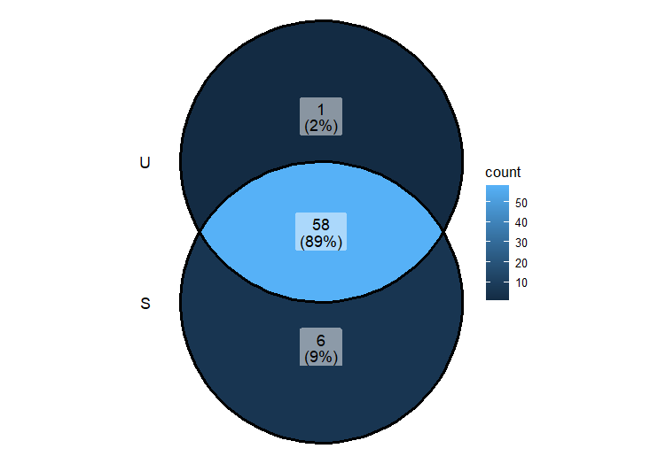
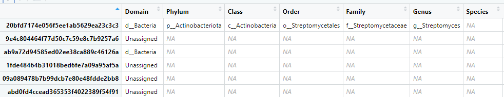
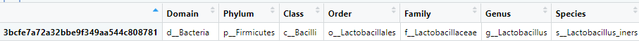
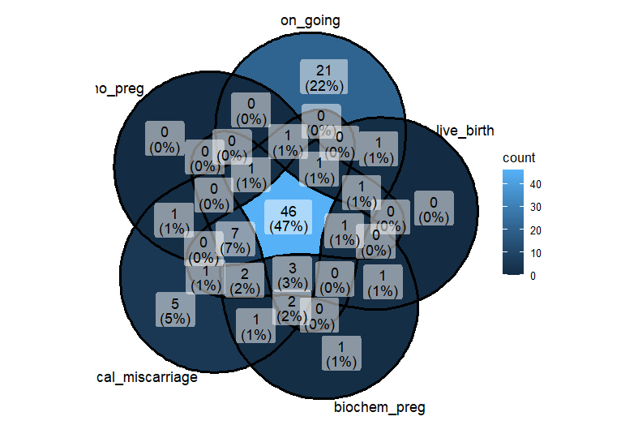

# March 24 2025

### What we have done

##### Aim 1 (Annalise):

##### Aim 2 (Michelle):
core microbiome analysis based on binned outcome (successful/unsucessful)
- detection = 0.001, prevalence = 0.1
   
  
  
  
  blast result for successful
  - for 9e4c804464f77d50c7c59e8c7b9257a6: https://blast.ncbi.nlm.nih.gov/Blast.cgi
  - for 1fde48464b31018bed6fe7a09a95af5a: https://blast.ncbi.nlm.nih.gov/Blast.cgi
  - for 09a089478b7b99dcb7e80e48fdde2bb8: https://blast.ncbi.nlm.nih.gov/Blast.cgi
  - for abd0fd4ccead365353f4022389f54f91: https://blast.ncbi.nlm.nih.gov/Blast.cgi

  

core microbiome analysis based on all 5 outcomes (live birth, on-going pregnancy, no pregnancy, clinical miscarriage, biochemical pregnancy) 
- detection = 0.001, prevalence = 0.1

  

##### Aim 3 (Wren)
### Questions to ask/Issues

### Meeting Notes

### Next Week
- evelyn joins meeting next week
