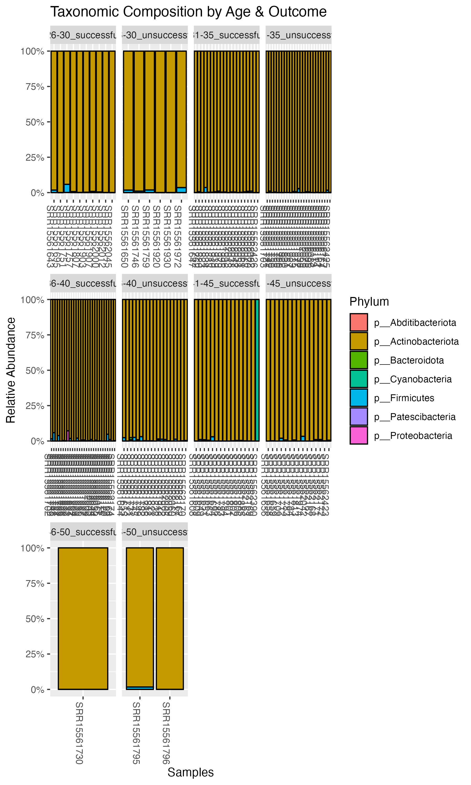

# March 24 2025

### What we have done

##### Aim 1 (Annalise):
Alpha Diversity:

- Shannon's Diversity:
  
 

 - Faith's PD:
   
 

Beta Diversity:

- Weighted Unifrac:
  
 

 - Bray Curtis:
   
 
 
 Taxonomic Analysis

 - By phylum

 - By class

 - By order

 - By family

 - By genus

 - By species

##### Aim 2 (Michelle):
core microbiome analysis based on binned outcome (successful/unsucessful)
- detection = 0.001, prevalence = 0.1
   
  
  
  
  blast result for successful
  - for 9e4c804464f77d50c7c59e8c7b9257a6: https://blast.ncbi.nlm.nih.gov/Blast.cgi?CMD=Get&RID=XP9U1J9V016&ADV_VIEW=yes&CONFIG_DESCR=ClustMemNbr,ClustComn,Ds,Sc,Ms,Ts,Cov,Eval,Idnt,AccLen,Acc
  - for 1fde48464b31018bed6fe7a09a95af5a: https://blast.ncbi.nlm.nih.gov/Blast.cgi?CMD=Get&RID=XP9UFFMV016&ADV_VIEW=yes&CONFIG_DESCR=ClustMemNbr,ClustComn,Ds,Sc,Ms,Ts,Cov,Eval,Idnt,AccLen,Acc
  - for 09a089478b7b99dcb7e80e48fdde2bb8: https://blast.ncbi.nlm.nih.gov/Blast.cgi?CMD=Get&RID=XP9UWFBN016&ADV_VIEW=yes&CONFIG_DESCR=ClustMemNbr,ClustComn,Ds,Sc,Ms,Ts,Cov,Eval,Idnt,AccLen,Acc
  - for abd0fd4ccead365353f4022389f54f91: https://blast.ncbi.nlm.nih.gov/Blast.cgi?CMD=Get&RID=XP9V4756016&ADV_VIEW=yes&CONFIG_DESCR=ClustMemNbr,ClustComn,Ds,Sc,Ms,Ts,Cov,Eval,Idnt,AccLen,Acc&ADV_VIEW=yes&CONFIG_DESCR=ClustMemNbr,ClustComn,Ds,Sc,Ms,Ts,Cov,Eval,Idnt,AccLen,Acc

  

core microbiome analysis based on all 5 outcomes (live birth, on-going pregnancy, no pregnancy, clinical miscarriage, biochemical pregnancy) 
- detection = 0.001, prevalence = 0.1

  

core microbiome analysis based on age groups 
- detection = 0.001, prevalence = 0.1

  

##### Aim 3 (Wren)
### Questions to ask/Issues

### Meeting Notes

### Next Week
- evelyn joins meeting next week
