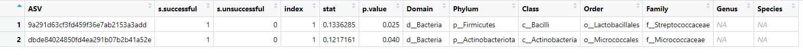
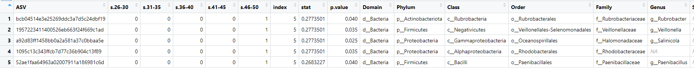
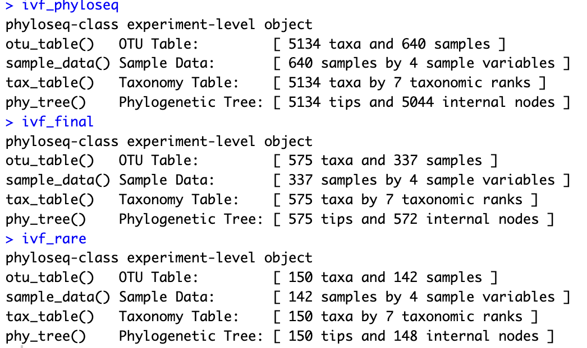

# March 3, 2025

## Agenda

### What we have done
R Portion:
- Aim 1: (still have to do statistical tests (linear regression model))
  - Shannon Diversity boxplots
  
  

  - Faith's PD boxplots
 
  
  
- Aim 2: ISA at p< 0.05
    - ISA based on outcome: both ASVs are associated with successful outcomes. 
      
    - ISA based on age group: all 5 ASVS are assocaited with 46-50 age group
      

### Questions to ask/Issues
- When creating phyloseq object, lots of taxonomy is "Unassigned" so when we put it in proper format to be a phyloseq object lots of samples come up as "Unassigned" or "NA":
  
    
- When creating phyloseq object, is filtering it and rarefaction needed? Because losing lots of samples:
 
- Phyloseq object rarefaction parameter (thinking of choosing 2500 as rarefaction parameter)
  

## Meeting Notes

  

## Week tasks

## Future Reference
- Dr. Evelyn Sun will be around for the last 2 meetings to help clarify/troubleshoot
  - Be prepared for these last 2 meetings 

  
