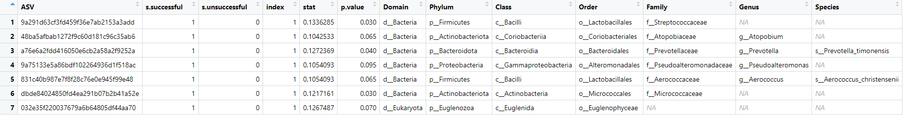

# March 3, 2025

## Agenda

### What we have done
R Portion:
- Aim 1: (still have to do statistical tests (linear regression model))
  - Shannon Diversity boxplots
  
  

  - Faith's PD boxplots
 
  

- Weighted Unifrac PCoA plot
  
- Aim 2:ISA based on reproductive outcome and age-group
  
    - ISA based on outcome: 
      - expected lactobacillus dominance in successful outcome, but found streptococcus (from the order lactobacillales)
      - maybe other taxa within the lactobacillales order may also play role in reproductive success?
      - ISA at p=0.05, 3 ASVs are associated with successful outcomes.
        
      - ISA at p=0.1, 7 ASVs are associated with successful outcomes.
        

    - ISA based on age group: 
      - indicated taxa are not the expected non-LD microbes
      - lactobacillus was not detected as an indicator taxon in the younger age groups
      - ISA at p=0.05: 6 ASVS are assocaited with 46-50 age group.
        
      - ISA at p=0.1: 7 ASVS are assocaited with 46-50 age group, 1 with 26-30, and 1 with 31-35 and 46-50
        

### Questions to ask/Issues
- When creating phyloseq object, lots of taxonomy is "Unassigned" so when we put it in proper format to be a phyloseq object lots of samples come up as "Unassigned" or "NA":
  
    
- When creating phyloseq object, is filtering it and rarefaction needed? Because losing lots of samples:
 
- Phyloseq object rarefaction parameter (thinking of choosing 2500 as rarefaction parameter)
  

## Meeting Notes

  

## Week tasks

## Future Reference
- Dr. Evelyn Sun will be around for the last 2 meetings to help clarify/troubleshoot
  - Be prepared for these last 2 meetings 

  
