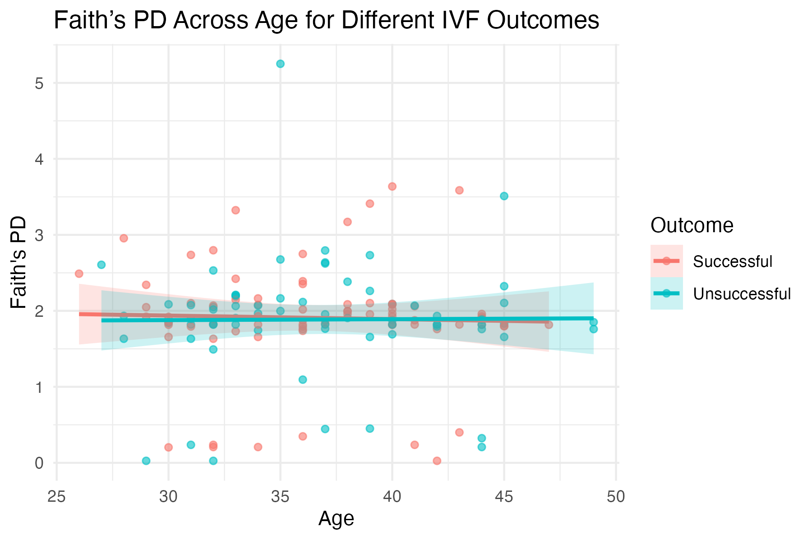

# March 31, 2025

### What we have done

- Finished slides for presentation
- Fixed alpha diversity linear regression plots:

 

 
  
- Random forest modelling:

- some literature search
  - paper which we obtained data from indicated that Streptomyces is positively correlated to lactobacillus, however unique to the EF

### Questions to ask/issues
- Should we include beta diversity and ISA results in the manuscript?

### Meeting Notes

### Next week

### Future Reference
- Presenting Team 3's research on Tuesday, April 1
- Team 3 presenting our slides on Thursday, April 3

